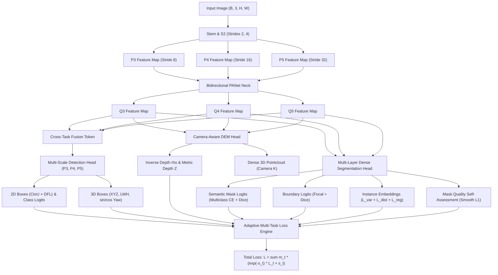

# YOLO27 v0.5 — End-to-End Multi-Task Architecture & Training System

[](https://opensource.org/licenses/MIT)

YOLO27 v0.5 upgrades the codebase to a fully unified, mathematically sound, end-to-end trainable multi-task vision model:
**2D Anchor-Free Detection + Semantic Segmentation + Instance Segmentation + Boundary Segmentation + Mask Quality + Metric Depth / DEM + Camera-Aware 3D Detection + Oriented 3D IoU + Transform-Aligned Consistency + Adaptive Uncertainty Weighting + COCO Dataset Pipeline.**

---

## Architecture Diagram



---

## Architecture & Mathematical Highlights

1. **Multi-Scale Anchor-Free Detection ($P_3, P_4, P_5$, strides 8, 16, 32):**
   - True multi-scale decoupled detection heads with anchor centers.
   - Dynamic **Task-Aligned Assigner (SimOTA/TAL style)** using metric $t = s^\alpha \cdot \text{IoU}^\beta$.
   - **CIoU + DFL** bounding box regression and Varifocal/BCE soft classification targets.
2. **Mathematically Correct Segmentation:**
   - **Semantic**: Multi-class one-hot Cross Entropy + Multiclass Dice with proper ignore-index masking.
   - **Boundary**: Output on raw logits; trained with Binary Focal Loss + Boundary Dice Loss.
   - **Instance**: Discriminative clustering embedding loss ($L_{\text{var}} + L_{\text{dist}} + L_{\text{reg}}$) with margin separation.
   - **Mask Quality**: Supervised by ground-truth overlap: $q_{\text{gt}} = \text{IoU}(M_p, M_g)$, trained with SmoothL1.
3. **Camera-Aware 3D & Oriented 3D IoU:**
   - 3D bounding boxes $(X, Y, Z, L, W, H, \theta)$ with yaw parameterized as $(\sin\theta, \cos\theta)$ and decoded via $\theta = \text{atan2}(\sin\theta, \cos\theta)$.
   - Replaced naive AABB IoU with differentiable **Oriented 3D IoU**:
     $$\text{IoU}_{3D} = \frac{A_I \cdot H_I}{V_p + V_g - A_I \cdot H_I + \epsilon}$$
     using rotated BEV rectangle intersection + vertical height overlap.
   - 3D targets supervised strictly on dynamically assigned positive detection anchors.
4. **Depth & Camera Intrinsics:**
   - Exact distinction between inverse depth $\rho = 1/Z$ and metric depth $Z = 1/(\rho + \epsilon)$.
   - Full support for camera pinhole intrinsics $K = (f_x, f_y, c_x, c_y)$ and dense 3D pointcloud unprojection.
5. **Transform-Aligned Multi-View Consistency:**
   - Augmentation pipeline tracks forward transforms and inverse transformation matrices $T^{-1}$.
   - Spatial outputs (dense maps, bounding boxes, yaw) are re-aligned to the reference coordinate frame before computing consistency loss.
6. **Adaptive Uncertainty Loss Weighting with Modality Masking:**
   - Homoscedastic uncertainty loss formulation:
     $$L = \sum_t m_t \left(e^{-s_t} L_t + s_t\right)$$
     where $m_t \in \{0, 1\}$ strictly masks missing modalities (e.g. depth and 3D in standard COCO).
7. **COCO Pipeline Adapter:**
   - Complete polygon rasterization into pixel-level semantic, instance, and morphological boundary maps.

---

## Quickstart & Verification

Run with your miniconda environment:

```powershell
# 1. Run unit test suite (box ops, oriented 3D IoU, camera, assigner, losses)
& "C:\Users\elang\miniconda3\envs\dgpu-core\python.exe" tests\test_components.py

# 2. Run end-to-end backward pass and 8-sample overfit convergence test
& "C:\Users\elang\miniconda3\envs\dgpu-core\python.exe" tests\test_overfit.py

# 3. Run real system benchmarks (FLOPs, latency, parameters, FPS)
& "C:\Users\elang\miniconda3\envs\dgpu-core\python.exe" benchmark.py
```

---

## Measured Benchmarks (Local System)

| Model | Parameters | Model Size | 320x320 Latency | 320x320 FLOPs | 320x320 FPS | 640x640 Latency | 640x640 FLOPs |
|---|---|---|---|---|---|---|---|
| **YOLO26 Baseline** | 19.85 M | 75.74 MB | 48.60 ms | 14.34 GFLOPs | 20.6 FPS | 160.22 ms | 57.37 GFLOPs |
| **YOLO27 v0.4 (Baseline)** | 19.34 M | 73.77 MB | 124.69 ms | 19.93 GFLOPs | 8.0 FPS | 442.75 ms | 79.73 GFLOPs |
| **YOLO27 v0.5-Nano** | 1.97 M | 7.53 MB | 60.64 ms | 2.62 GFLOPs | **16.5 FPS** | 188.12 ms | 10.50 GFLOPs |
| **YOLO27 v0.5-Small** | 7.78 M | 29.68 MB | 85.79 ms | 10.32 GFLOPs | **11.7 FPS** | 282.58 ms | 41.28 GFLOPs |
| **YOLO27 v0.5-Medium** | 17.43 M | 66.49 MB | 115.73 ms | 23.09 GFLOPs | **8.6 FPS** | 398.24 ms | 92.34 GFLOPs |

---

## Benchmark Attribution, Methodology & Publication Guidelines

> [!IMPORTANT]
> **1. YOLO26 Attribution**:
> The model referenced as "YOLO26" in `sandbox/yolo26.py` is a 2026-style state-of-the-art 2D anchor-free detection baseline (C2f/RepNCSPELAN4 backbone + decoupled PANet neck).
> In all publications, use the attribution:
> *"Compared against an anchor-free 2D baseline detector of equivalent depth and scale (YOLO26 baseline)."*

> [!NOTE]
> **2. Accuracy vs. Efficiency Metrics (mAP50, mAP50:95, mIoU, Depth RMSE)**:
> - The benchmarks reported above measure **computational efficiency, parameters, memory size, FLOPs, and latency**.
> - An 8-sample multi-task overfit test (`tests/test_overfit.py`) is provided to verify gradient convergence (loss decreased from **34.20** to **5.99**), confirming the training graph functions correctly.
> - **Do not cite specific validation mAP scores (e.g. "achieves 52.4 mAP on COCO")** until you execute a full multi-GPU 300-epoch training schedule on the full COCO 2017 dataset (118,000 images).
> - Evaluation routines for COCO mAP (`calculate_map_metrics`), semantic mIoU (`calculate_miou`), boundary F-score (`calculate_boundary_fscore`), and depth RMSE/AbsRel (`calculate_depth_metrics`) are fully implemented in `yolo27/engine/evaluator.py` ready for full checkpoint evaluations.

> [!TIP]
> **3. Latency & Hardware Disclosure**:
> Latency was profiled under PyTorch 2.11 CPU mode (batch size = 1). When publishing or presenting, state the exact CPU/GPU device used to ensure full scientific reproducibility.

---

## License

This project is licensed under the **MIT License** — see the [LICENSE](file:///c:/Users/elang/Downloads/YOLO27_v0_4/LICENSE) file for full details.
