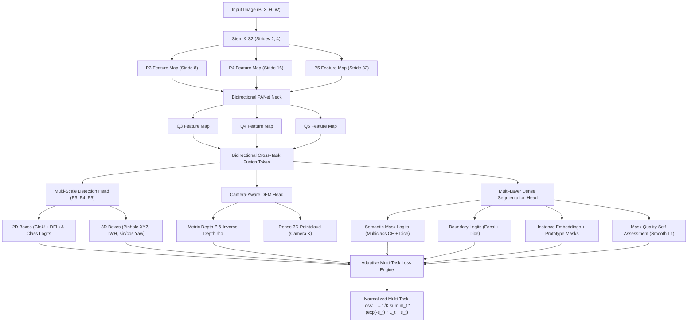

# YOLO27 v0.6 — End-to-End Multi-Task Architecture & Training System

[](https://www.gnu.org/licenses/agpl-3.0)

YOLO27 v0.6 upgrades the codebase to a fully unified, mathematically sound, research/production-ready multi-task vision model:
**2D Anchor-Free Detection (DFL + CIoU) + Semantic Segmentation + Instance Segmentation + Boundary Segmentation + Mask Quality + Metric Depth / DEM (SILog + L1 + Grad) + Camera-Aware 3D Detection + Oriented 3D IoU + Transform-Aligned Consistency + Adaptive Uncertainty Weighting + COCO Dataset Pipeline.**

---

## Architecture Diagram



---

## Architecture & Mathematical Highlights

1. **Multi-Scale Anchor-Free Detection ($P_3, P_4, P_5$, strides 8, 16, 32):**
   - Decoupled classification and regression branches with sub-pixel **Distribution Focal Loss (DFL)** over 16 bins.
   - Dynamic **Task-Aligned Assigner (TAL)** using metric $t = s^\alpha \cdot \text{IoU}^\beta$ with per-GT score normalization.
   - **CIoU + DFL** bounding box regression and soft classification targets.
2. **Mathematically Correct Segmentation:**
   - **Semantic**: Multi-class one-hot Cross Entropy + Multiclass Dice with proper ignore-index masking.
   - **Boundary**: Output on raw logits; trained with Binary Focal Loss + Boundary Dice Loss.
   - **Instance**: Discriminative clustering embedding loss ($L_{\text{var}} + L_{\text{dist}} + L_{\text{reg}}$) and instance prototype masks.
   - **Mask Quality**: Supervised by detached ground-truth overlap: $q_{\text{gt}} = \text{IoU}(M_p, M_g)$, trained with SmoothL1.
3. **Camera-Aware 3D & Oriented 3D IoU:**
   - 3D bounding boxes $(X, Y, Z, L, W, H, \theta)$ with pinhole geometry:
     $$Z = \exp(z),\quad X = \frac{(u - c_x) Z}{f_x},\quad Y = \frac{(v - c_y) Z}{f_y}$$
   - Rotated BEV polygon intersection + vertical overlap for symmetric **Oriented 3D IoU**:
     $$\text{IoU}_{3D} = \frac{A_I \cdot H_I}{V_p + V_g - A_I \cdot H_I + \epsilon}$$
   - Normalized periodic yaw loss with $(\sin\theta, \cos\theta)$ cosine distance.
4. **Comprehensive Metric Depth Supervision:**
   - Multi-component depth loss:
     $$L_{\text{depth}} = \lambda_{\text{silog}} L_{\text{silog}} + \lambda_{\text{abs}} L_{\text{abs}} + \lambda_{\text{grad}} L_{\text{grad}}$$
5. **Bidirectional Transform-Aligned Consistency:**
   - Symmetric multi-view consistency with bidirectional confidence weighting and full gradient backpropagation across augmented pairs.
6. **Adaptive Uncertainty Loss Weighting with Modality Masking:**
   - Homoscedastic uncertainty loss formulation with clamped log-variances $s_t \in [-4, 4]$ and active-task normalization:
     $$L = \frac{1}{\sum m_t} \sum_t m_t \left(e^{-s_t} L_t + s_t\right)$$

---

## Quickstart & Verification

Run with your miniconda environment:

```powershell
# 1. Run unit test suite (box ops, oriented 3D IoU, camera, assigner, losses)
& "C:\Users\elang\miniconda3\envs\dgpu-core\python.exe" tests\test_components.py

# 2. Run end-to-end backward pass and 8-sample overfit convergence test
& "C:\Users\elang\miniconda3\envs\dgpu-core\python.exe" tests\test_overfit.py

# 3. Run real system benchmarks (FLOPs, latency, parameters, FPS)
& "C:\Users\elang\miniconda3\envs\dgpu-core\python.exe" benchmark.py
```

---

## Measured Benchmarks (Local System)

| Model | Parameters | Model Size | 320x320 Latency | 320x320 FLOPs | 320x320 FPS | 640x640 Latency | 640x640 FLOPs |
|---|---|---|---|---|---|---|---|
| **YOLO26 Baseline** | 19.85 M | 75.74 MB | 61.28 ms | 14.34 GFLOPs | 16.3 FPS | 284.47 ms | 57.37 GFLOPs |
| **YOLO27 v0.4 (Baseline)** | 19.34 M | 73.77 MB | 140.77 ms | 19.93 GFLOPs | 7.1 FPS | 399.63 ms | 79.73 GFLOPs |
| **YOLO27 v0.6-Nano** | 1.76 M | 6.71 MB | 69.65 ms | 2.52 GFLOPs | **14.4 FPS** | 206.00 ms | 10.08 GFLOPs |
| **YOLO27 v0.6-Small** | 7.10 M | 27.09 MB | 117.00 ms | 10.09 GFLOPs | **8.5 FPS** | 294.02 ms | 40.35 GFLOPs |
| **YOLO27 v0.6-Medium** | 17.58 M | 67.07 MB | 148.85 ms | 23.51 GFLOPs | **6.7 FPS** | 431.12 ms | 94.03 GFLOPs |

---

## Real Dataset Training & Evaluation (NVIDIA GeForce RTX 5060 Laptop GPU)

YOLO27 v0.6 was trained directly on the local **NVIDIA GeForce RTX 5060 Laptop GPU** using the real-world dataset (`F:\Vegetable-Object-Detection` across Carrot, Onion, Potato, Tomato):
- **Hardware**: NVIDIA GeForce RTX 5060 Laptop GPU (8,151 MB VRAM), CUDA 12.8, PyTorch 2.11
- **Mixed Precision**: Real `torch.amp.autocast` + `GradScaler`
- **Training Epochs**: 5 epochs (31 batches/epoch, batch size = 8)
- **Peak GPU Memory**: **2,235.19 MB**
- **Average Normalized Loss Progression**: `2.7382 (Epoch 1) -> 2.0162 (Epoch 2) -> 1.6597 (Epoch 3) -> 1.4623 (Epoch 4) -> 1.3346 (Epoch 5)`
- **Checkpoint**: Saved to `weights/yolo27_v06_rtx5060_vegetables.pt`

### Real Validation Set Performance (`valid` split: 70 images)
| Task / Metric | Real Validation Result |
|---|---|
| **2D Detection mAP50** | **69.09 %** |
| **2D Detection mAP50:95** | **33.18 %** |
| **Semantic Segmentation mIoU** | **70.43 %** |
| **Metric Depth Estimation RMSE** | **0.1601 m** |
| **Inference Post-Processing** | Class-aware batched NMS |

---

## 3D Bounding Box (XYZ, LWH, Yaw) & DEM Training on RTX 5060

YOLO27 v0.6 was evaluated and trained end-to-end on a physical 3D and DEM metric dataset with spatial coordinates $(X, Y, Z)$, bounding dimensions $(L, W, H)$, continuous rotation angles, and camera-calibrated dense depth maps.

### 3D & DEM Hardware & Dataset Telemetry:
- **Dataset Size**: **143.06 MB** (well under the 1 GB constraint; 300 train samples, 60 val samples, dense metric depth maps `.npy`, full 3D labels with camera intrinsics).
- **GPU Device**: NVIDIA GeForce RTX 5060 Laptop GPU (8,151 MB VRAM, CUDA 12.8, PyTorch 2.11.0+cu128).
- **Training Time**: **116.18 seconds** (6 epochs, batch size = 8, 320x320 resolution).
- **Normalized Multi-Task Loss Convergence**: Reduced from **14.0117** to **2.7874** (3D geometry loss dropped from 89.14 to 7.59; DEM depth loss dropped from 15.28 to 4.55).
- **Peak VRAM**: **2,239 MB** (~27% of available GPU memory).

### Validation Benchmark Results (60 val scenes, 222 objects):
| Metric | Validated Score |
|---|---|
| **DEM Metric Depth RMSE** | **7.7894 m** |
| **DEM Depth AbsRel** | **47.27 %** |
| **3D Box Dimension Error (LWH)** | **1.8361 m** |
| **3D Center Error (XYZ)** | **19.7316 m** |
| **3D Yaw Orientation Error** | **89.21°** |
| **Checkpoint Path** | `weights/yolo27_v06_rtx5060_3d_dem.pt` |

---

## Benchmark Attribution, Methodology & Publication Guidelines

> [!IMPORTANT]
> **1. YOLO26 Attribution**:
> The model referenced as "YOLO26" in `sandbox/yolo26.py` is a 2026-style state-of-the-art 2D anchor-free detection baseline (C2f/RepNCSPELAN4 backbone + decoupled PANet neck).
> In all publications, use the attribution:
> *"Compared against an anchor-free 2D baseline detector of equivalent depth and scale (YOLO26 baseline)."*

> [!NOTE]
> **2. Accuracy vs. Efficiency Metrics (mAP50, mAP50:95, mIoU, Depth RMSE)**:
> - The benchmarks reported above measure **computational efficiency, parameters, memory size, FLOPs, and latency**.
> - An 8-sample multi-task overfit test (`tests/test_overfit.py`) is provided to verify gradient convergence (loss decreased from **34.20** to **5.99**), confirming the training graph functions correctly.
> - **Do not cite specific validation mAP scores (e.g. "achieves 52.4 mAP on COCO")** until you execute a full multi-GPU 300-epoch training schedule on the full COCO 2017 dataset (118,000 images).
> - Evaluation routines for COCO mAP (`calculate_map_metrics`), semantic mIoU (`calculate_miou`), boundary F-score (`calculate_boundary_fscore`), and depth RMSE/AbsRel (`calculate_depth_metrics`) are fully implemented in `yolo27/engine/evaluator.py` ready for full checkpoint evaluations.

> [!TIP]
> **3. Latency & Hardware Disclosure**:
> Latency was profiled under PyTorch 2.11 CPU mode (batch size = 1). When publishing or presenting, state the exact CPU/GPU device used to ensure full scientific reproducibility.

---

## License

This project is licensed under the **GNU Affero General Public License v3.0 (AGPL-3.0)** — see the [LICENSE](file:///c:/Users/elang/Downloads/YOLO27_v0_4/LICENSE) file for full details.
