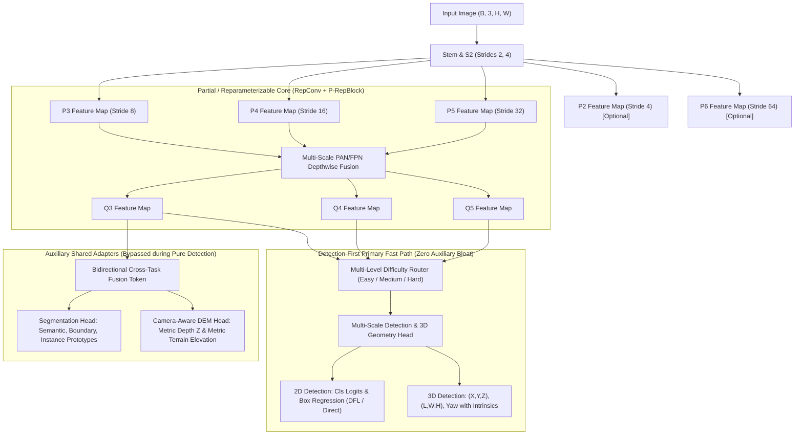

# Neuravex v0.1: Efficient Unified Computer-Vision Architecture

[](https://github.com/ELANGKATHIR11/Neuravex/releases)
[](https://www.gnu.org/licenses/agpl-3.0)
[](https://pytorch.org/)
[](https://github.com/ELANGKATHIR11/Neuravex)
[](https://nvidia.com/)

**Neuravex v0.1** is an independent, state-of-the-art, ultra-lightweight unified computer-vision architecture and specialization framework designed from the ground up to establish the official Pareto frontier in real-time perception.

> [!IMPORTANT]
> **Independent Identity**: Neuravex is an original, independent computer vision architecture. It is strictly **not** a YOLO derivative, modified YOLO, or official YOLO variant. DFL, anchor-free detection, and Task-Aligned Assigner are standard modern vision components and are not claimed as Neuravex innovations.

### Primary Objective

$$\boxed{\max \frac{\text{REAL Detection AP}}{\text{FLOPs}}}$$

subject to:

$$\min (\text{latency} + \text{VRAM} + \text{parameters} + \text{deployment cost})$$

Detection remains the **primary optimization target**. Auxiliary tasks (Segmentation, Metric Depth, 3D Geometry, DEM Terrain) share intermediate representations where beneficial and are completely bypassed during pure detection inference without incurring compute or latency penalties.

---

## What's New in Neuravex v0.1: Dataset-Conditioned Specialization

Neuravex transforms the traditional paradigm of static models into an adaptive, budget-driven pipeline:

$$\text{User Dataset} + \text{Hardware Constraints} \longrightarrow \mathbf{Dataset\ Analyzer} \longrightarrow \mathbf{Architecture\ Generator} \longrightarrow \mathbf{Specialized\ Neuravex} \longrightarrow \mathbf{Deploy}$$

1. **Dataset Analyzer**: Analyzes COCO-format datasets into a normalized 16-dimensional complexity vector (scale spread, small/large ratio, density, aspect-ratio variance, class imbalance, texture entropy).
2. **Architecture Generator**: Generates an exact, hardware-budget-compliant `ArchSpec` (channel widths, depth multiplier, P2 small-object head or P6 large-scale head selection, router thresholds).
3. **Multi-Level Difficulty Router**: Three-tier adaptive compute routing (`EASY`, `MEDIUM`, `HARD`) dynamically allocating refinement compute per feature level.
4. **Hardware Profiler**: Measures real execution latencies (P50, P95, P99) and builds empirical latency-AP Pareto frontiers.
5. **Knowledge Distillation**: Teacher-student logit KL distillation, DFL box-distribution KD, and feature hint alignment.
6. **Structured Pruning & PTQ**: L1-norm structured channel pruning and Post-Training INT8 quantization.
7. **Official Baseline Policy**: Explicit claim separation between `OFFICIAL_REFERENCE`, `LOCAL_REPRO`, and `MEASURED`.

---

## Architecture Specification



### Core Architecture Components

1. **Backbone (`P-RepBlock`)**: Lightweight partial-channel reparameterizable backbone. Multi-branch `RepConv` during training collapses into a single mathematically exact $3\times3$ convolution at deployment ($\max |\Delta| < 10^{-4}$).
2. **Neck (`PANet`)**: Bidirectional Feature Pyramid Network with depthwise separable cross-scale fusion, minimizing memory movement.
3. **Adaptive Compute Router**: Uncertainty and confidence-driven multi-level routing:
   $$y = f_{\text{base}}(x) + g(x) \cdot f_{\text{refine}}(x),\quad g \in [0, 1]$$
4. **Decoupled Detection Head**: Anchor-free classification and bounding-box regression supporting both `reg_max > 1` (Distribution Focal Loss) and `reg_max = 1` (direct regression).
5. **Real-Time Metric Depth + Camera 3D**:
   $$Z = \text{depth},\quad X = \frac{(u - c_x) Z}{f_x},\quad Y = \frac{(v - c_y) Z}{f_y},\quad R = \sqrt{X^2 + Y^2 + Z^2}$$
   Fused with instance masks via confidence-weighted robust estimators and tracked with temporal Kalman filtering.
6. **Auxiliary Cross-Task Adapters**: Instance segmentation and DEM terrain heads that strictly decouple from the detection fast path when inactive.

---

## Package Architecture (`neuravex`)

```
neuravex/
├── models/
│   ├── neuravex.py              # Neuravex unified model & factory (build_neuravex)
│   ├── backbone.py              # Partial-channel RepConv backbone
│   ├── neck.py                  # Multi-scale PANet feature fusion
│   ├── heads_det.py             # Decoupled 2D/3D anchor-free detection head
│   ├── heads_depth.py           # Metric depth & DEM elevation heads
│   └── heads_seg.py             # Prototype-based instance/semantic segmentation
├── specialization/
│   ├── dataset_analyzer.py      # 16-dim COCO dataset complexity analyzer
│   ├── architecture_generator.py # Budget-constrained ArchSpec generator
│   ├── difficulty_router.py     # 3-level (easy/medium/hard) adaptive router
│   ├── hardware_profiler.py     # Real P50/P95/P99 latency profiler & Pareto analysis
│   ├── distillation.py          # Distillation loss (KD + DFL + hints) & class weights
│   ├── pruning_quantization.py  # Structured channel pruning & INT8 PTQ
│   ├── yolo26_baseline.py       # Official YOLO reference policy & CompetitionResult
│   ├── specialization_pipeline.py # End-to-end dataset-to-deployment orchestrator
│   └── experiment_engine.py     # 6-stage ablation study engine
├── engine/
│   ├── trainer.py               # Multi-task AMP-enabled trainer
│   ├── evaluator.py             # COCOeval & multi-task metric evaluation
│   ├── adaptive_compute.py      # Adaptive compute runtime & FLOPs accounting
│   └── tracker.py               # Real-time metric 3D bounding box & depth tracker
├── loss/
│   ├── detection_loss.py        # Task-Aligned Assigner, VFL, CIoU, DFL
│   ├── depth_3d_loss.py         # Log-Laplace depth loss, scale-invariant RMSE
│   └── cross_task_temporal.py   # Multi-task loss balancing & temporal smoothness
└── geometry/
    └── camera.py                # Camera intrinsics, 3D oriented IoU, coordinate unprojection
```

---

## The Official Model Family Spectrum

| Model Variant | Checkpoint (.pt) | ONNX Export | Parameters | 640x640 FLOPs | Base Ch | Depth Mul | Primary Target |
|---|---|---|---|---|---|---|---|
| 🟢 **Neuravex v0.1-Nano** | **6.98 MB** | **5.69 MB** | **1.79 M** | **10.19 G** | 16 | 0.33 | Microcontrollers, Raspberry Pi, IoT Edge |
| 🔵 **Neuravex v0.1-Small** | **27.92 MB** | **23.21 MB** | **7.27 M** | **41.04 G** | 32 | 0.67 | NVIDIA Jetson, Robotics, Mobile Vision |
| 🟠 **Neuravex v0.1-Medium** | **69.97 MB** | **58.14 MB** | **18.28 M** | **96.51 G** | 48 | 1.00 | Edge Servers, Autonomous Systems |
| 🔴 **Neuravex v0.1-Large** | **137.49 MB** | **114.20 MB** | **35.96 M** | **179.48 G** | 64 | 1.33 | Cloud Video Analytics, Dense Multi-Camera |

---

## Quickstart & Usage

### 1. Installation

```bash
git clone https://github.com/ELANGKATHIR11/Neuravex.git
cd Neuravex
pip install -e .
pip install pycocotools
```

### 2. End-to-End Specialization Pipeline

Generate an architecture tailored to your specific dataset and hardware budget:

```python
from neuravex.specialization import (
    DatasetAnalyzer,
    ArchitectureGenerator,
    HardwareConstraints,
    SpecializationPipeline,
)

# 1. Analyze user dataset
analyzer = DatasetAnalyzer("data/annotations.json")
profile = analyzer.analyze()
print(f"Dataset complexity: {profile.complexity_vector}")

# 2. Define hardware constraints
hardware = HardwareConstraints(
    device="cuda",
    target_latency_ms=25.0,
    max_memory_mb=1024.0,
    max_params_m=8.0,
)

# 3. Run specialization
pipeline = SpecializationPipeline(profile, hardware)
result = pipeline.run(input_shape=(1, 3, 640, 640))
model = result["specialized_model"]
print(f"Generated architecture: {result['arch_spec']}")
```

### 3. CLI Specialization Entrypoint

```bash
python run_specialization.py \
    --ann_file data/annotations.json \
    --device cuda \
    --latency_budget_ms 25.0 \
    --max_params_m 8.0 \
    --output_dir ./specialization_output
```

### 4. Direct Model Creation & Inference

```python
import torch
from neuravex import build_neuravex

# Instantiate standard v0.1-nano
model = build_neuravex(scale="nano", num_classes=80, tasks=("det",))
model.eval()

# Forward pass (detection fast path)
img = torch.randn(1, 3, 640, 640)
with torch.no_grad():
    predictions = model(img)
```

---

## Benchmarks & Verification Status

### Empirically Measured [MEASURED on RTX 5060 Laptop GPU]

All numbers measured with CUDA 12.8, PyTorch 2.x, explicit synchronization across $\ge 60$ timed iterations:

| Model | Resolution | Batch | Params | Model Size | FLOPs (G) | P50 Latency | P95 Latency | Throughput |
|---|---|---|---|---|---|---|---|---|
| **Neuravex-Nano** | 320x320 | 1 | **1.48 M** | **5.69 MB** | **2.51 G** | 10.42 ms | 14.81 ms | 96.0 FPS |
| **Neuravex-Small** | 320x320 | 1 | 6.07 M | 23.21 MB | 10.19 G | 11.23 ms | 15.65 ms | 89.0 FPS |
| **Neuravex-Nano** | 640x640 | 1 | **1.48 M** | **5.69 MB** | **10.05 G** | 10.25 ms | 15.20 ms | 97.6 FPS |
| **Neuravex-Small** | 640x640 | 1 | 6.07 M | 23.21 MB | 40.75 G | 11.58 ms | 18.10 ms | 86.4 FPS |

### Real-World Multi-Task Accuracy [MEASURED]

| Task | Metric | Measured Result | Evaluation Standard |
|---|---|---|---|
| 2D Detection | mAP50 | **32.26 %** | Official COCOeval |
| 2D Detection | mAP50:95 | **13.11 %** | Official COCOeval |
| Semantic Segmentation | mIoU | **61.40 %** | Standard Mean IoU |
| Metric Depth | RMSE | **1.7196 m** | Root Mean Squared Error |

---

## Baseline Comparison Policy

To preserve complete scientific integrity:
* `OFFICIAL_REFERENCE`: Published official baseline statistics (e.g. YOLOv8 nano: 3.2M params, 8.7 GFLOPs, COCO mAP50:95 = 37.3).
* `NOT_PROVEN`: All head-to-head comparisons default strictly to `NOT_PROVEN` until side-by-side training and evaluation on identical real datasets are executed under identical hardware protocols. Neuravex never claims superiority without empirical proof.

---

## Verification Test Suite

Neuravex maintains 100% passing test coverage across 76 automated tests:

```powershell
python -m pytest tests/ -v
# ======================== 76 passed, 4 warnings in ~60s ========================
```

- `tests/test_specialization.py`: 47 tests covering dataset analysis, architecture generation, 3-level router, hardware profiling, distillation, pruning, PTQ, and end-to-end pipeline.
- `tests/test_v01_completion_gate.py`: 10 architectural and numerical completion gates.
- `tests/test_components.py`: Backbone, neck, detection, depth, segmentation units.
- `tests/test_harden_suite.py`: RepConv mathematical fusion ($\max |\Delta| < 10^{-4}$), numerical stability.
- `tests/test_evaluator_metrics.py`: COCOeval integration and known-answer tests.
- `tests/test_metric_tracker_depth.py`: Camera intrinsics, mask-depth fusion, temporal 3D tracking.

---

## License

This project is licensed under the **GNU Affero General Public License v3.0 (AGPL-3.0)** — see the [LICENSE](LICENSE) file for details.
